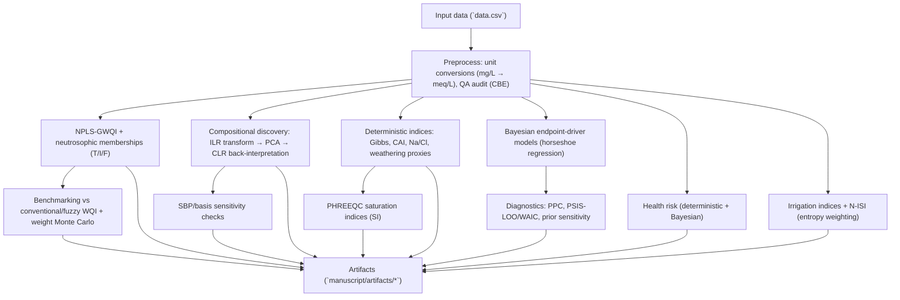

# Analysis Workflow (overview)

This workflow summarises how `data.csv` is transformed into the manuscript artifacts referenced in `manuscript/sections/**/*.md`.

## Reproducible artifact generation

The reviewer-response artifacts introduced in this revision are produced by:

- `manuscript/reviewer_revision_artifacts.py` (CBE tables, PHREEQC SI, Bayesian diagnostics/PPC, prior sensitivity, ILR basis sensitivity, WQI benchmarking, irrigation disagreement)
- `manuscript/reviewer_revision_artifacts_stage2.py` (risk-uncertainty decomposition and any additional risk summaries)

The baseline manuscript artifacts are generated by the project’s existing analysis workflow (see `generation_script.py` and the contents of `manuscript/artifacts/`).
