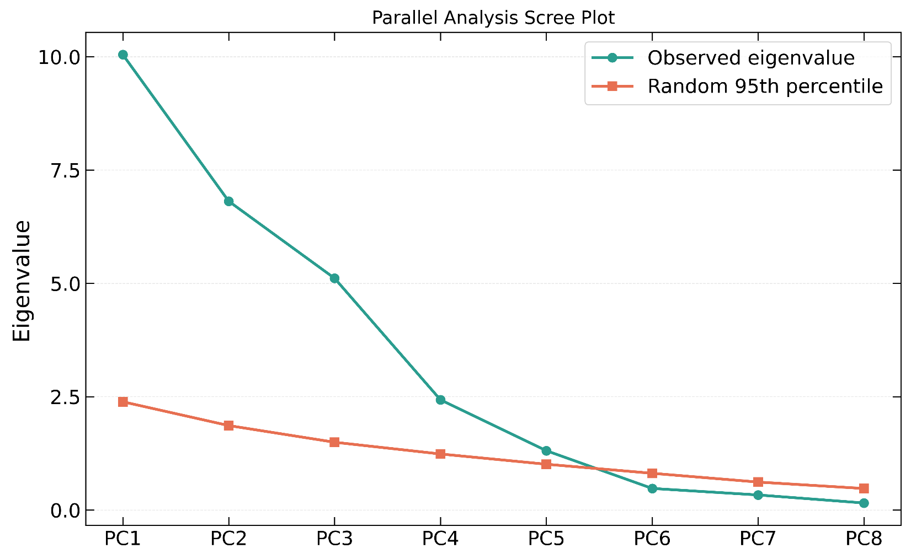
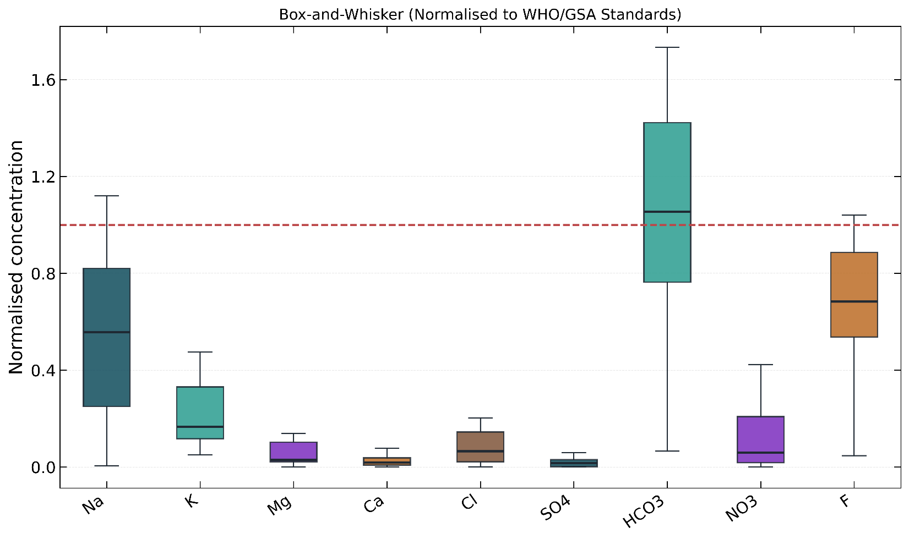
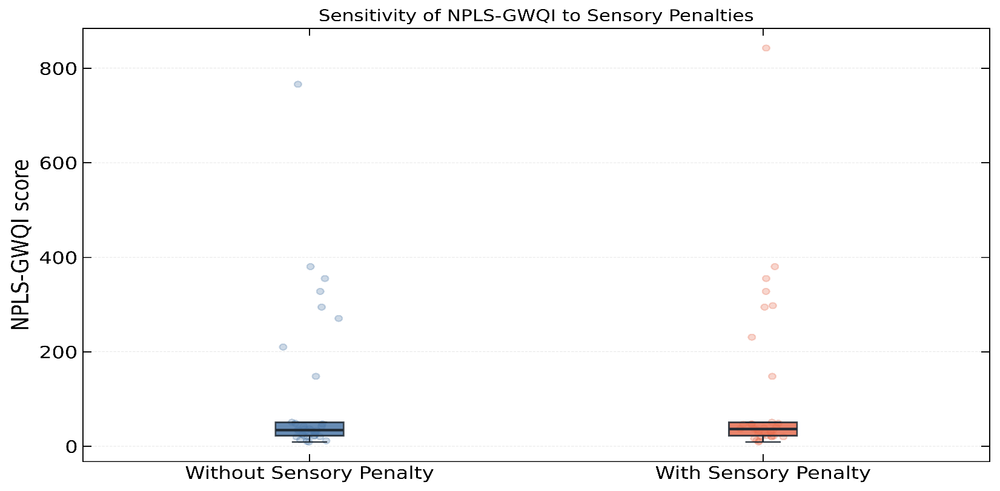
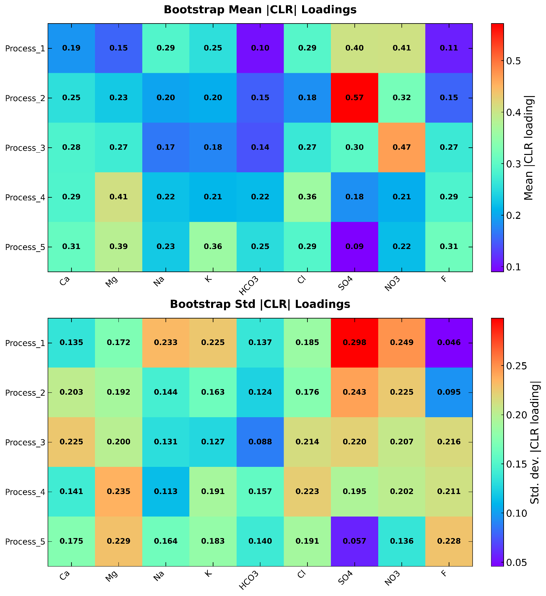

**Competing Geochemical Drivers and Probabilistic Health Risks of Groundwater in the Semi-Arid Voltaian Sedimentary Basin, Ghana**

Dickson Abdul-Wahab<sup>a</sup>, Emmanuel Daanoba Sunkari<sup>b,c,d\*</sup>, Celestina Akasi Yalley<sup>e</sup>, Ebenezer Aquisman Asare<sup>f</sup>, Cynthia Laar<sup>g</sup>, Tulika Chakrabarti<sup>b, h</sup>, & Abayneh Ataro Ambushe<sup>d</sup>

<sup>a</sup>Department of Nuclear Science and Applications, School of Nuclear and Allied Sciences, University of Ghana, Atomic-Kwabenya, Accra, Ghana

<sup>b</sup>Centre of Excellence in Environmental Science and Sustainability, Sir Padampat Singhania University, Udaipur 313 601, Rajasthan, India

<sup>c</sup>Mining Engineering, Faculty of Integrated and Advanced Technology, Sir Padampat Singhania University, Udaipur 313601, Rajasthan, India

<sup>d</sup>Department of Chemical Sciences, Faculty of Science, University of Johannesburg, Auckland Park 2006, P.O. Box 524, Johannesburg, South Africa

<sup>e</sup>Department of Geological Engineering, Faculty of Geosciences and Environmental Studies, University of Mines and Technology, P.O. Box 237, Tarkwa, Ghana

<sup>f</sup>Nuclear Chemistry and Environmental Research Centre, National Nuclear Research Institute (NNRI), Ghana Atomic Energy Commission (GAEC), Box LG 80, Legon, Accra, Ghana

<sup>g</sup>Water Resources Research Centre, National Nuclear Research Institute, Ghana Atomic Energy Commission, Box LG 80, Legon, Accra, Ghana

<sup>h</sup>Chemistry, Faculty of Applied Sciences, Sir Padampat Singhania University, Udaipur 313601, Rajasthan, India

\*Corresponding Author: emmanueldaanobasunkari@gmail.com

\*ORCID: 0000-0002-0898-2286

**Supplementary Information**

**Supplementary Methodology**

# S1. Neutrosophic Partial Least Squares Groundwater Quality Index (NPLS-GWQI): Full Mathematical Derivation

## S1.1 Conceptual Motivation

Conventional arithmetic water quality indices (WQI) assign fixed, expert-specified weights to hydrochemical parameters and apply hard thresholds to define compliance, producing a single scalar that collapses genuine ambiguity into an overconfident class membership <sup>1,2</sup>. NPLS-GWQI replaces this architecture with three structural innovations: (i) a neutrosophic representation of threshold uncertainty that formally distributes each sample’s membership across truth, indeterminacy, and falsity; (ii) a data-driven PLS-derived weighting scheme that recalibrates variable contributions from the observed hydrochemical variance structure rather than from subjective expert assignment; and (iii) a bootstrapped stability envelope that quantifies how sensitively the weight vector responds to sample-level perturbation <sup>3</sup>.

## S1.2 Step 1 — Parameter Normalisation Against Guideline Values

For each hydrochemical parameter $`i \in 1,\ldots,p`$ and sample $`s \in 1,\ldots,n`$, the raw concentration $`C_{i,s}`$ (mg/L) is normalised against the adopted guideline standard S_i to produce a dimensionless hazard ratio:

|                                 
 ``` math                         
 q_{i,s} = \frac{C_{i,s}}{S_{i}}  
 ```                              | (S1) |
|---------------------------------|------|

where $`S_{i}`$ is the lower of the (World Health Organization (WHO), 2019) and Ghana Standards Authority (GSA) drinking-water guideline values for parameter $`i`$. The guideline values applied in this study are listed in Table S-A. A value of $`q_{i,s} = 1`$ represents the threshold; $`q_{i,s} < 1`$ indicates compliance; $`q_{i,s} > 1`$ indicates exceedance.

**Table S-A. Guideline values (**$`\mathbf{S}_{\mathbf{i}}`$**) used for NPLS-GWQI normalisation**

| **Parameter** | **WHO/GSA** $`\mathbf{S}_{\mathbf{i}}`$ **(mg/L)** | **Adopted standard** |
|----|----|----|
| pH | 6.5–8.5 | Bipolar (see §S1.3) |
| EC | 1500 µS/cm | WHO |
| TDS | 1000 | WHO/GSA |
| Na | 200 | WHO |
| K | 12 | WHO |
| Mg | 150 | WHO |
| Ca | 200 | WHO |
| Cl | 250 | WHO |
| SO₄ | 250 | WHO |
| HCO₃ | 500 | WHO |
| NO₃ | 50 | WHO |
| F | 1.5 | WHO/GSA |

## S1.3 Step 2 — Bipolar pH Treatment

pH exhibits a bilateral hazard: both acid deviation ($`\text{pH} < 6.5`$) and alkaline deviation ($`\text{pH} > 8.5`$) represent water quality concerns. Applying a simple upper-threshold ratio would be physically misleading for this parameter. Instead, two unidirectional hazard scores are computed and the maximum is taken as the effective normalised hazard:

| 
``` math
q_{\text{pH},s}^{\text{acid}} = \frac{7.0 - \text{pH}_{s}}{7.0 - 6.5} = \frac{7.0 - \text{pH}_{s}}{0.5}
``` | (S2) |
|:--:|:--:|
| 
``` math
q_{\text{pH},s}^{\text{alk}} = \frac{\text{pH}_{s} - 7.0}{8.5 - 7.0} = \frac{\text{pH}_{s} - 7.0}{1.5}
``` | (S3) |
| 
``` math
q_{\text{pH},s} = \max\left( q_{\text{pH},s}^{\text{acid}},q_{\text{pH},s}^{\text{alk}} \right)\text{|}_{\geq 0}
``` | (S4) |

This formulation returns zero hazard at neutral pH (7.0) and increases monotonically toward either extreme, reaching unity at the regulatory limits of 6.5 and 8.5. The result replaces the standard ratio for pH in all subsequent steps.

## S1.4 Step 3 — Neutrosophic Membership Functions

Neutrosophic set theory extends classical fuzzy logic by partitioning membership into three independently valued components: truth ($`T`$), indeterminacy ($`I`$), and falsity ($`F`$), where $`T\  + \ I\  + \ F`$ need not equal unity, allowing incomplete and indeterminate states to coexist <sup>5</sup>. Applied to water quality assessment, these components characterise, respectively, clear compliance, ambiguous transition near the guideline threshold, and clear violation.

For each parameter $`i`$ and sample $`s`$, the three components are defined as continuous functions of $`q_{i,s}`$:

| 
``` math
T_{i,s} = \exp\left( - ,1.5;q_{i,s} \right)
``` | (S5) |
|:--:|:--:|
| 
``` math
F_{i,s} = \frac{1}{1 + \exp\left( - 10,\left( q_{i,s} - 1 \right) \right)}
``` | (S6) |
| 
``` math
I_{i,s} = \exp\left( - \frac{1}{2}\left( \frac{q_{i,s} - 1}{0.2} \right)^{2} \right)
``` | (S7) |

**Interpretation.** The truth function (S5) is an exponential decay that takes $`T\  = \ 1`$ when $`q\  = \ 0`$ (zero concentration) and approaches zero monotonically as $`q`$ increases, with the decay constant $`\lambda = \ 1.5`$ chosen so that $`T\  \approx 0.22`$ at the guideline limit ($`q\  = \ 1`$). The falsity function (S6) is a logistic sigmoid centred at $`q\  = \ 1`$, with steepness parameter k = 10, that approaches 0 for fully compliant samples and 1 for strongly violating samples. The indeterminacy function (S7) is a Gaussian kernel centred at $`q\  = \ 1`$ with bandwidth $`\sigma_{I} = 0.20`$, concentrating ambiguity in the transition zone $`\lbrack 0.80,1.20\rbrack`$ and decaying rapidly outside it.

The three functions generate bounded, non-negative outputs for all $`q\  \geq 0`$ and do not require explicit normalisation constraints.

## S1.5 Step 4 — Neutrosophic Multi-Channel Predictor Construction

To encode the neutrosophic state structure into a form suitable for PLS regression, three channel-specific predictor matrices are constructed by modulating the raw concentration matrix with each membership component:

| 
``` math
\mathbf{X}_{T} = \left\lbrack C_{i,s} \cdot T_{i,s} \right\rbrack_{n \times p}\ \ \ \ \mathbf{X}_{I} = \left\lbrack C_{i,s} \cdot I_{i,s} \right\rbrack_{n \times p}\ \ \ \ \mathbf{X}_{F} = \left\lbrack C_{i,s} \cdot F_{i,s} \right\rbrack_{n \times p}
``` | (S8) |
|----|----|

The unified predictor matrix passed to PLS is the element-wise sum of the three channels:

| 
``` math
\mathbf{X}_{\text{cmie}} = \mathbf{X}_{\mathbf{T}} + \mathbf{X}_{\mathbf{I}} + \mathbf{X}_{\mathbf{F}}
``` | (S9) |
|----|----|

This construction ensures that the PLS decomposition operates on a single matrix whose entries carry physical concentration units scaled by the neutrosophic state of each measurement, so that the variance structure extracted by PLS reflects genuine hydrochemical differentiation rather than raw compositional magnitude alone. The three-dimensional stack $`\mathcal{X}_{\mathcal{TIF}} \in \mathbb{R}^{\mathbb{n} \times \mathbb{p} \times \mathbb{3}}`$ (with slices $`X_{T},X_{I},X_{F}`$) is retained for the channel-decomposed N-VIP computation described in §S1.6. The response matrix supplied to PLS is the $`n\  \times p`$ hazard matrix $`Q = \left\lbrack q_{i},s \right\rbrack`$.

## S1.6 Step 5 — Channel-Decomposed Neutrosophic Variable Importance in Projection (N-VIP)

Standard VIP scores in PLS measure each predictor’s contribution to the total explained variance across retained latent components <sup>6</sup>. N-VIP extends this to the three neutrosophic channels, computing channel-specific VIP scores that separately quantify the truth-channel, indeterminacy-channel, and falsity-channel contributions to the latent structure, then aggregating them via the $`L^{2}`$ norm.

Let the fitted PLS model have $`A = \min(3,p)`$ latent components. Denote by $`W \in \mathbb{R}^{\mathbb{p} \times \mathbb{A}}`$ the matrix of x-weight vectors and by $`Q^{*} \in \mathbb{R}^{\mathbb{A} \times \mathbb{1}}`$ the vector of y-loading norms across components. Before channel-specific projections, each channel matrix is mean-centred and scaled by the model’s fitted x-standard deviations $`\widehat{\sigma_{x}} \in \mathbb{R}^{\mathbb{p}}`$ (inherited from the sklearn PLSRegression fit):

| 
``` math
\widetilde{\mathbf{X}_{T}} = \frac{\mathbf{X}_{\mathbf{T}} - \overline{\mathbf{X}_{T}}}{\widehat{\mathbf{\sigma}}x},\quad{\widetilde{\mathbf{X}}}_{I} = \frac{\mathbf{X}_{\mathbf{I}} - \overline{\mathbf{X}_{I}}}{\widehat{\mathbf{\sigma}}x},\quad{\widetilde{\mathbf{X}}}_{F} = \frac{\mathbf{X}_{\mathbf{F}} - \overline{\mathbf{X}_{F}}}{\widehat{\mathbf{\sigma}_{x}}}
``` | (S10) |
|----|----|

The latent score matrices for each channel under the PLS weight vectors are:

| 
``` math
\mathbf{T}_{\text{ch}} = \widetilde{\mathbf{X}_{ch}},\mathbf{W}\quad\text{ch} \in T,I,F
``` | (S11) |
|----|----|

The sum of squares of the response explained by component a via each channel is:

| 
``` math
\mathbf{SS}_{ch,a} = \left| \mathbf{T}_{ch, \cdot a} \right|^{2} \cdot \left| \ {\mathbf{Q}^{\mathbf{*}}}_{\mathbf{a}} \right|^{2},\quad\mathbf{SS}_{ch} \in R^{A}
``` | (S12) |
|----|----|

The total explained sum of squares across all channels and components is:

| 
``` math
\mathbf{SS}_{\text{total}} = \sum_{}^{}\text{ch}\sum_{a = 1}^{A}\text{SS}_{\text{ch},a}
``` | (S13) |
|----|----|

The channel-specific VIP score for variable $`j`$ via channel $`ch`$ is:

| 
``` math
{VIP}_{j,\text{ch}} = \sqrt{p \cdot \frac{\sum_{}^{}{a = 1^{A}w_{ja}^{2}} \cdot {SS}_{\text{ch},a}}{{SS}_{\text{total}}}}
``` | (S14) |
|----|----|

where $`w_{ja}`$ is element $`(j,a)`$ of $`W`$. The aggregate N-VIP score for variable *j* is:

| 
``` math
{N - VIP}_{j} = \sqrt{{VIP}_{j,T}^{2} + {VIP}_{j,I}^{2} + {VIP}_{j,F}^{2}}
``` | (S15) |
|----|----|

This $`L^{2}`$ aggregation preserves information from all three neutrosophic channels without allowing any single channel to dominate, and guarantees non-negativity. The aggregate N-VIP vector is then normalised to unit sum to produce dynamic weights:

|                                                                   
 ``` math                                                           
 w_{j} = \frac{\text{N-VIP}_{j}}{\sum_{j = 1}^{p}\text{N-VIP}_{j}}  
 ```                                                                | (S16) |
|-------------------------------------------------------------------|-------|

## S1.7 Step 6 — Bootstrap Stabilisation of Dynamic Weights

To guard against sensitivity to the particular 34-sample dataset, the weight vector is estimated via B = 50 bootstrap resamples. On each resample $`b`$:

1.  Draw $`n\  = \ 34`$ indices with replacement from $`1,\ldots,34`$ to form bootstrap dataset $`\mathcal{D}_{\mathcal{b}}`$.

2.  Fit PLS on ($`X_{\text{cmie},b},,Q_{b}`$) with $`A = \min(3,p)`$ components.

3.  Compute $`\text{N-VIP}^{(b)}`$ via Equations (S10)–(S15) on the bootstrap channel matrices.

4.  Normalise to $`w^{(b)}`$ via Equation (S17).

The final dynamic weight vector is the bootstrap mean:

|                                                            
 ``` math                                                    
 \widehat{w}j = \frac{1}{B}\sum_{}^{}{b = 1^{B}w_{j}^{(b)}}  
 ```                                                         | (S17) |
|------------------------------------------------------------|-------|

The resulting weights, reported in Table 3, reflect the expected contribution of each parameter across plausible realisations of the dataset. The complete bootstrapped weight distribution for the 12 parameters is:

| **Parameter** |                                   
                 ``` math                           
                 \widehat{\mathbf{w}_{\mathbf{j}}}  
                 ```                                | **Rank** |
|---------------|-----------------------------------|----------|
| EC            | 0.1019                            | 1        |
| Cl            | 0.1012                            | 2        |
| TDS           | 0.1011                            | 3        |
| Ca            | 0.0996                            | 4        |
| K             | 0.0956                            | 5        |
| Na            | 0.0945                            | 6        |
| F             | 0.0907                            | 7        |
| HCO₃          | 0.0729                            | 8        |
| NO₃           | 0.0714                            | 9        |
| Mg            | 0.0704                            | 10       |
| SO₄           | 0.0602                            | 11       |
| pH            | 0.0405                            | 12       |

## S1.8 Step 7 — Sub-Index Construction and Sensory Penalty

A neutrosophic scalar that amplifies the hazard ratio by the degree of ambiguity and violation is defined as:

|                                    
 ``` math                            
 \Psi_{i,s} = 1 + F_{i,s} - T_{i,s}  
 ```                                 | (S18) |
|------------------------------------|-------|

This scalar equal unity when a sample is perfectly compliant $`(T \rightarrow 1,F \rightarrow 0)`$, exceeds unity as the sample approaches and crosses the guideline threshold, and attains a maximum of approximately 2 for strongly violating samples $`(T \rightarrow 0,F \rightarrow 1)`$. The per-parameter sub-index is:

|                                                            
 ``` math                                                    
 SI_{i,s}\, = q_{i,s}\, \times \, 100\, \times \,\Psi_{i,s}  
 ```                                                         | (S19) |
|------------------------------------------------------------|-------|

An aesthetic–sensory penalty $`\Pi_{s}`$ is applied to account for impairment in palatability and household acceptability that is not captured by the strict health-guideline ratio:

|                                                                    
 ``` math                                                            
 \Pi_{s} = \left\{ \begin{matrix}                                    
 1.10 & \text{if }\text{TDS}_{s} > 500\text{ mg}\text{/}\text{L} \\  
 1.00 & \text{otherwise}                                             
 \end{matrix} \right.\                                               
 ```                                                                 | (S20) |
|--------------------------------------------------------------------|-------|

An additional factor of 1.25 applies when dissolved iron exceeds 0.3 mg/L (aesthetic staining threshold); iron was not measured in this study and the iron pathway was inactive.

## S1.9 Step 8 — NPLS-GWQI Score and Classification

The NPLS-GWQI for sample s is the weighted sum of sub-indices, modified by the sensory penalty:

| 
``` math
\text{NPLS-GWQI}_{s} = \Pi_{s} \cdot \sum_{i = 1}^{p}\widehat{w_{i}} \cdot \text{SI}_{i,s}
``` | (S21) |
|----|----|

Final scores are classified according to the following thresholds, which correspond to the standard neutrosophic groundwater quality classification scheme:

| **Class** | **NPLS-GWQI Range** | **Interpretation** |
|----|----|----|
| Excellent | $`\leq`$ 50 | Fully compliant; no treatment required |
| Good | (50,; 100\] | Minor deviations; generally acceptable |
| Poor | (100,; 200\] | Significant deviations; treatment advisable |
| Very Poor | (200,; 300\] | Multiple exceedances; treatment required |
| Unsuitable | \> 300 | Severe impairment; not suitable for drinking |

The class-resolved results, together with neutrosophic component means, are reported in Table 4.

# **S2. Hierarchical Bayesian Multipathway Risk Assessment (HBMPRA): Full Model** Specification

## S2.1 Deterministic Baseline — Average Daily Dose and Hazard Quotient

Non-carcinogenic risk for contaminant c and demographic group k is expressed through the hazard quotient (HQ), which compares the estimated average daily ingestion dose to the contaminant-specific reference dose:

| 
``` math
\text{ADD}_{c,k} = \frac{C_{c} \cdot \text{IR}_{k} \cdot \text{EF} \cdot \text{ED}_{k}}{\text{BW}_{k} \cdot \text{AT}_{k}}
``` | (S22) |
|:--:|:--:|
| 
``` math
\text{HQ}_{c,k} = \frac{\text{ADD}_{c,k}}{\text{RfD}_{c}}
``` | (S23) |

All deterministic exposure parameters are listed in Table S-B. The organ-specific hazard index aggregates HQ values over contaminants sharing the same target organ:

|                                                                
 ``` math                                                        
 \text{HI}_{organ,k} = \sum_{c \in C_{organ}}^{}\text{HQ}_{c,k}  
 ```                                                             | (S24) |
|----------------------------------------------------------------|-------|

where $`C_{organ}`$ is the subset of contaminants acting on that organ system.

**Table S-B. Fixed deterministic exposure parameters**

| **Parameter** | **Adults (k=1)** | **Children (k=2)** | **Teens (k=3)** | **Unit** |
|----|----|----|----|----|
| Body weight (BW) | 60.0 | 15.0 | 45.0 | kg |
| Ingestion rate (IR) | 2.5 | 1.0 | 1.5 | L/day |
| Exposure duration (ED) | 30 | 6 | 16 | years |
| Skin surface area (SA) | 18,000 | 6,600 | 12,000 | cm² |
| Exposure time (ET) | 0.58 | 1.0 | 0.70 | h/day |
| Exposure frequency (EF) | 365 | 365 | 365 | days/year |
| Averaging time (AT = ED × 365) | 10,950 | 2,190 | 5,840 | days |

**Table S-C. Contaminant-specific toxicological reference values**

| **Contaminant** | **RfD\_\text{oral} (mg/kg/day)** | **Target organ** | **Source** |
|----|----|----|----|
| Fluoride (F) | 0.06 | Skeletal–dental | <sup>7</sup> |
| Nitrate (NO₃) | 1.60 | Haematological | <sup>7</sup> |

Dermal and inhalation pathways were inactive in this study; the model architecture accommodates them for future extensions.

## S2.2 Bayesian Model Structure — Rationale for Hierarchical Priors

The deterministic approach in §S2.1 treats BW, IR, and ED as fixed constants, which ignores the inter-individual variability that characterises population-level exposure. HBMPRA addresses this by modelling BW and IR as group-level random variables whose distributions are informed by published physiological data, thereby propagating exposure uncertainty into posterior distributions of HI rather than single-point estimates <sup>8,9</sup>.

Concentration variability is propagated via a sample-informed truncated-normal prior, acknowledging that the 34-sample dataset is a finite realisation of a spatially variable groundwater system. The full model operates simultaneously across the three demographic groups, with each group sharing the functional form of the prior while having its own group-specific hyperparameters.

## S2.3 Prior Distributions for Exposure Parameters

### S2.3.1 Body Weight (BW)

Body weight is modelled on the log scale to enforce positivity and accommodate right-skewed population distributions. The coefficient of variation (CV) for adult and adolescent body weight is set at 21%, consistent with published population anthropometric surveys. The log-normal parameterisation for group k is:

| 
``` math
\sigma_{\ln BW} = \sqrt{\ln\left( 1 + CV_{BW}^{2} \right)},\quad CV_{BW} = 0.21
``` | (S25) |
|:--:|:--:|
| 
``` math
\begin{array}{r}
\mu_{\ln BW,k} = \ln\left( {\overline{BW}}_{k} \right) - \frac{1}{2}\ln\left( 1 + CV_{BW}^{2} \right)
\end{array}
``` | (S26) |

A non-centred parameterisation is used to improve NUTS sampler geometry:

| 
``` math
z_{k}^{\text{BW}} \sim \mathcal{N}(0,1)
``` | (S27) |
|:--:|:--:|
| 
``` math
BW_{g,k} = \exp\left( \mu_{\ln BW,k} + z_{k}^{BW} \cdot \sigma_{\ln BW} \right)
``` | (S28) |

**Table S-D. Log-normal BW prior hyperparameters**

| **Group** | $`{\overline{\text{BW}}}_{\mathbf{k}}`$ **(kg)** | 
``` math
\mathbf{\mu}_{\mathbf{ln}\text{BW}\mathbf{,k}}
``` | 
``` math
\mathbf{\sigma}_{\mathbf{ln}\text{BW}}
``` |
|----|----|----|----|
| Adults | 60.0 | 4.0891 | 0.2088 |
| Children | 15.0 | 2.6645 | 0.2088 |
| Teens | 45.0 | 3.7842 | 0.2088 |

### S2.3.2 Ingestion Rate per Unit Body Weight (IR/BW)

Ingestion rate per unit body weight ($`\text{IR}_{\text{bw},k}`$*,* L/kg/day) is modelled on the log scale with standard deviation $`\sigma\ln\text{IR} = 0.6nats`$, consistent with the substantial inter-individual variability documented in water ingestion surveys:

| 
``` math
\mu_{\ln IR,k} = \ln\left( \frac{{\overline{IR}}_{k}}{{\overline{BW}}_{k}} \right)
``` | (S29) |
|:--:|:--:|
| 
``` math
z_{k}^{IR} \sim N(0,1)
``` | (S30) |
| 
``` math
IR_{bw,g,k} = \exp\left( \mu_{\ln IR,k} + z_{k}^{IR} \cdot \sigma_{\ln IR} \right)
``` | (S31) |

**Table S-E. Log-normal IR/BW prior hyperparameters**

| **Group** | $`{\overline{\text{IR}}}_{\mathbf{k}}\textit{\textbf{/}}{\overline{\text{BW}}}_{\mathbf{k}}`$ **(L/kg/day)** | 
``` math
\mathbf{\mu}_{\mathbf{ln}\left( \text{IR}\text{/}\text{BW} \right)\mathbf{,k}}
``` | 
``` math
\mathbf{\sigma}_{\mathbf{ln}\text{IR}}
``` |
|----|----|----|----|
| Adults | 0.04167 | −3.1781 | 0.60 |
| Children | 0.06667 | −2.7081 | 0.60 |
| Teens | 0.03333 | −3.4012 | 0.60 |

### S2.3.3 Contaminant Concentration ($`\mathbf{C}_{\mathbf{c}}`$)

Each contaminant concentration is modelled as a truncated normal random variable informed by the 34-sample dataset:

| 
``` math
C_{c} \sim TN\left( \mu_{c} = \overline{C_{c}},\sigma_{c} = \widehat{s_{c}} + \varepsilon,\ \text{lower} = 0 \right)
``` | (S32) |
|----|----|

where $`\overline{C_{c}}`$ and $`\widehat{s_{c}}`$ are the sample mean and standard deviation from the observed data, and $`\varepsilon = 10^{- 6}`$ prevents degenerate zero-variance priors. The truncation at zero enforces physical non-negativity.

**Table S-F. Concentration prior parameters**

| **Contaminant** | $`\overline{\mathbf{C}_{\mathbf{c}}}`$ **(mg/L)** | $`\widehat{\mathbf{s}_{\mathbf{c}}}`$ **(mg/L)** |
|----|----|----|
| Fluoride (F) | ~0.82 | ~0.51 |
| Nitrate (NO₃) | ~1.08 | ~0.75 |

*(Means and standard deviations computed from the 34 observed values.)*

## S2.4 Likelihood and Derived Quantities

The chronic daily intake via ingestion for contaminant c and group k is computed from the stochastic exposure variables:

| 
``` math
\text{CDI}_{ing,c,k} = C_{c} \cdot \text{IR}_{bw,g,k} \cdot \text{EF}_{v} \cdot \text{ED}_{k}
``` | (S33) |
|----|----|

where $`\text{EF}_{v} = \text{EF/}365 = 1.0`$(daily exposure assumed throughout the year) and ED is in years. The ingestion hazard quotient for each group is:

|                                                               
 ``` math                                                       
 \text{HQ}_{c,k} = \frac{\text{CDI}_{ing,c,k}}{\text{RfD}_{c}}  
 ```                                                            | (S34) |
|---------------------------------------------------------------|-------|

The organ-specific hierarchical hazard index is then:

|                                                                
 ``` math                                                        
 \text{HI}_{organ,k} = \sum_{c \in C_{organ}}^{}\text{HQ}_{c,k}  
 ```                                                             | (S35) |
|----------------------------------------------------------------|-------|

No explicit observation-level likelihood is specified: the model propagates prior uncertainty through the deterministic exposure pathway to produce posterior predictive distributions of HI. This design, in which the uncertainty is carried by the prior rather than a data-conditional likelihood, is appropriate because the risk model is a forward calculation rather than a parameter-inference problem <sup>10</sup>.

## S2.5 MCMC Sampling Configuration

The posterior was approximated by NUTS (No-U-Turn Sampler) as implemented in PyMC v5:

| **Sampler setting**             | **Value**                               |
|---------------------------------|-----------------------------------------|
| Algorithm                       | NUTS (adaptive Hamiltonian Monte Carlo) |
| Draws per chain                 | 2,000                                   |
| Tuning steps                    | 500                                     |
| Chains                          | 2                                       |
| Target acceptance rate (\delta) | 0.90                                    |
| Random seed                     | Fixed (reproducibility)                 |
| Cores                           | 1                                       |
| Log-likelihood storage          | Disabled                                |

Total posterior draws: $`2 \times 2,000 = 4,000`$. Chain convergence was assessed by inspecting $`\widehat{R}`$ (potential scale reduction factor) and effective sample size (ESS); all parameters achieved $`\widehat{R} < 1.01`$ and $`\text{ESS} > 400`$.

Posterior summaries reported in Table 11 include: posterior mean HI, 2.5th and 97.5th percentiles (95% credible interval), and the posterior exceedance probability $`\mathbb{P}\left( \text{HI} > 1\mid y \right)`$, computed as the fraction of posterior draws exceeding unity.

# S3. Neutrosophic Irrigation Suitability Index (N-ISI): Full Mathematical Derivation

## S3.1 Irrigation Index Formulas (meq/L)

All seven indices are computed from ion concentrations converted to milliequivalents per litre (meq/L) via valence-based stoichiometric factors. The formulas and their agronomic interpretation are as follows.

### S3.1.1 Sodium Adsorption Ratio (SAR)

| 
``` math
\text{SAR} = \frac{\left\lbrack Na^{+} \right\rbrack}{\sqrt{\frac{\left\lbrack Ca^{2 +} \right\rbrack + \left\lbrack Mg^{2 +} \right\rbrack}{2}}}
``` | (S36) |
|----|----|

SAR quantifies the relative sodium hazard relative to divalent cation competition; high values favour irreversible Na-clay deflocculation <sup>11</sup>.

**S3.1.2 Soluble Sodium Percentage (SSP)**

| 
``` math
\text{SSP} = \frac{\left\lbrack Na^{+} \right\rbrack + \left\lbrack K^{+} \right\rbrack}{\left\lbrack Ca^{2 +} \right\rbrack + \left\lbrack Mg^{2 +} \right\rbrack + \left\lbrack Na^{+} \right\rbrack + \left\lbrack K^{+} \right\rbrack} \times 100
``` | (S37) |
|----|----|

SSP captures the combined alkali hazard of sodium and potassium expressed as a percentage of total dissolved cations <sup>12</sup>.

### S3.1.3 Magnesium Hazard (MH)

| 
``` math
\text{MH} = \frac{\left\lbrack Mg^{2 +} \right\rbrack}{\left\lbrack Ca^{2 +} \right\rbrack + \left\lbrack Mg^{2 +} \right\rbrack} \times 100
``` | (S38) |
|----|----|

MH assesses the relative proportion of magnesium: high Mg relative to Ca adversely affects soil structure and crop uptake <sup>13</sup>.

### S3.1.4 Kelly’s Ratio (KR)

| 
``` math
\text{KR} = \frac{\left\lbrack Na^{+} \right\rbrack}{\left\lbrack Ca^{2 +} \right\rbrack + \left\lbrack Mg^{2 +} \right\rbrack}
``` | (S39) |
|----|----|

KR measures the ratio of sodium to the combined divalent cation pool; values greater than unity indicate excess sodium hazard <sup>14</sup>.

### S3.1.5 Permeability Index (PI) — Doneen (1964)

| 
``` math
\text{PI} = \frac{\left\lbrack Na^{+} \right\rbrack + \sqrt{\left\lbrack HCO_{3}^{-} \right\rbrack}}{\left\lbrack Ca^{2 +} \right\rbrack + \left\lbrack Mg^{2 +} \right\rbrack + \left\lbrack Na^{+} \right\rbrack} \times 100
``` | (S40) |
|----|----|

PI integrates bicarbonate contribution to soil permeability; unlike the other six indices, higher PI is better (Class I: \> 75; Class II: 25–75; Class III: \< 25).

### S3.1.6 Residual Sodium Carbonate (RSC)

| 
``` math
\text{RSC} = \left( \left\lbrack HCO_{3}^{-} \right\rbrack + \left\lbrack CO_{3}^{2 -} \right\rbrack \right) - \left( \left\lbrack Ca^{2 +} \right\rbrack + \left\lbrack Mg^{2 +} \right\rbrack \right)
``` | (S41) |
|----|----|

RSC quantifies residual alkalinity after precipitation of calcium and magnesium carbonates; positive values indicate progressive soil sodification <sup>15</sup>.

### S3.1.7 Potential Salinity (PS)

| 
``` math
\text{PS} = \left\lbrack Cl^{-} \right\rbrack + 0.5\left\lbrack SO_{4}^{2 -} \right\rbrack
``` | (S42) |
|----|----|

PS reflects the combined salinity contribution of the most soluble anions; sulphate contributes at half weight because its salt-formation propensity is intermediate between chloride and carbonate <sup>16</sup>.

## S3.2 Individual Index Thresholds and Classification

| **Index** | **Threshold** $`\mathbf{S}_{\mathbf{j}}`$ | **Criterion** | **Classification boundaries** |
|----|----|----|----|
| SAR | 
``` math
10\text{ }{\text{(}\text{meq}\text{/}\text{L)}}^{0.5}
``` | Lower is better | $`\leq 10`$: Excellent; 10–18: Good; 18–26: Doubtful; \>26: Unsuitable |
| SSP | 60 % | Lower is better | $`\leq`$<!-- -->20: Excellent; 20–40: Good; 40–60: Permissible; 60–80: Doubtful; \>80: Unsuitable |
| MH | 50 % | Lower is better | $`\leq 50`$: Suitable; \>50: Unsuitable |
| KR | 1.0 | Lower is better | $`\leq 1`$: Suitable; \>1: Unsuitable |
| PI | 75 % | **Higher is better** | \>75: Excellent; 25–75: Good; \<25: Unsuitable |
| RSC | 1.25 meq/L | Lower is better | $`\leq 1.25`$: Safe; 1.25–2.5: Marginal; \>2.5: Unsuitable |
| PS | 5 meq/L | Lower is better | Guideline adapted from Doneen (1954) |

## S3.3 Hazard Normalisation

Each index value $`I_{j,s}`$ is normalised to a dimensionless hazard ratio $`Y_{j,s}`$ with respect to its guideline threshold $`S_{j}`$. Because PI is a benefit index (higher is better), its hazard direction is reversed:

For all indices except PI:

|                                 
 ``` math                         
 Y_{j,s} = \frac{I_{j,s}}{S_{j}}  
 ```                              | (S43) |
|---------------------------------|-------|

For PI:

| 
``` math
Y_{PI,s} = \frac{100 - I_{PI,s}}{100 - S_{PI}} = \frac{100 - PI_{s}}{25}
``` | (S44) |
|----|----|

All hazard ratios are clamped at zero: $`Y_{j,s} \leftarrow \max\left( Y_{j,s},;0 \right)`$. Under this convention, Y = 0 corresponds to perfect compliance, Y = 1 to the guideline boundary, and Y \> 1 to exceedance.

## S3.4 Neutrosophic Membership Functions for Irrigation Indices

The neutrosophic membership functions for the N-ISI are calibrated differently from those in the NPLS-GWQI, reflecting that the truth function should attain T = 0.5 exactly at the guideline boundary (Y = 1) to create a balanced suitability characterisation:

| 
``` math
T_{j,s} = \exp\left( - 0.693 \cdot Y_{j,s} \right)
``` | (S45) |
|:--:|:--:|
| 
``` math
F_{j,s} = \frac{1}{1 + \exp\left( - 10\left( Y_{j,s} - 1 \right) \right)}
``` | (S46) |
| 
``` math
I_{j,s} = \exp\left( - \frac{1}{2}\left( \frac{Y_{j,s} - 1}{0.2} \right)^{2} \right)
``` | (S47) |

The decay constant in (S45) is $`\lambda = \ln 2 \approx 0.693`$, which ensures $`T_{j,s}(Y = 1) = e^{- 0.693} = 0.5`$. This makes the truth-falsity crossover occur exactly at the guideline threshold, providing a symmetric suitability characterisation around Y = 1.

## S3.5 Entropy-Based Objective Weighting

Weights for the seven indices are derived from the Shannon entropy of the normalised hazard distribution, assigning higher weight to indices whose values are more dispersed across the sample set (i.e., indices that are more discriminatory):

**Step 1: Min–max normalisation of the hazard matrix:**

| 
``` math
\widetilde{Y_{j,s}} = \frac{Y_{j,s} - \min_{s}Y_{j,s}}{\max_{s}Y_{j,s} - \min_{s}Y_{j,s} + \varepsilon},\quad\varepsilon = 10^{- 10}
``` | (S48) |
|----|----|

**Step 2: Probability matrix:**

| 
``` math
p_{j,s} = \frac{\widetilde{Y_{j,s}}}{\sum_{s = 1}^{n}\widetilde{Y_{j,s}} + \varepsilon}
``` | (S49) |
|----|----|

**Step 3: Shannon entropy for index j:**

| 
``` math
e_{j} = - \frac{1}{\ln n}\sum_{s = 1}^{n}p_{j,s}\ln\left( p_{j,s} + \varepsilon \right)
``` | (S50) |
|----|----|

where the $`1\text{/}\ln n`$ factor normalises entropy to the interval \[0,1\] and n = 34.

**Step 4: Degree of diversification:**

|                   
 ``` math           
 d_{j} = 1 - e_{j}  
 ```                | (S51) |
|-------------------|-------|

**Step 5: Normalised weight:**

| 
``` math
w_{j} = \frac{d_{j}}{\sum_{j = 1}^{m}d_{j} + \varepsilon},\quad m = 7
``` | (S52) |
|----|----|

The resulting entropy-derived weights are:

| **Index** | **Entropy weight** $`\mathbf{w}_{\mathbf{j}}`$ | **Rank** |
|-----------|------------------------------------------------|----------|
| PI        | 0.3459                                         | 1        |
| PS        | 0.2742                                         | 2        |
| KR        | 0.2632                                         | 3        |
| SAR       | 0.0668                                         | 4        |
| MH        | 0.0141                                         | 5        |
| RSC       | 0.0293                                         | 6        |
| SSP       | 0.0065                                         | 7        |

PI, PS, and KR account for 88.3% of the composite weight, reflecting their substantially greater spread across the 34 samples compared with SSP and MH.

## S3.6 N-ISI Score Construction and Classification

The per-index suitability score $`\eta_{j,s}`$ is derived from the truth and falsity components:

|                                              
 ``` math                                      
 \eta_{j,s} = \frac{1 + T_{j,s} - F_{j,s}}{2}  
 ```                                           | (S53) |
|----------------------------------------------|-------|

This quantity maps to \[0,1\]: when Y = 0 (perfect compliance), $`T\  \rightarrow 1`$ and $`F\  \rightarrow 0`$, giving $`\eta \rightarrow 1`$; at the threshold Y = 1, T = F = 0.5, giving $`\eta = \ 0.5`$; for strongly violating samples $`T\  \rightarrow 0`$ and $`F\  \rightarrow 1`$, giving $`\eta \rightarrow 0`$.

The composite N-ISI score for sample $`s`$ is:

|                                                                
 ``` math                                                        
 \text{N-ISI}_{s} = 100 \cdot \sum_{j = 1}^{m}{w_{j}\eta_{j,s}}  
 ```                                                             | (S54) |
|----------------------------------------------------------------|-------|

Scores are bounded to \[0, 100\] by construction. Classification uses the following thresholds:

| **N-ISI Score** | **Class**  | **Interpretation**                  |
|-----------------|------------|-------------------------------------|
| \> 85           | Excellent  | Suitable for all irrigation uses    |
| 70–85           | Good       | Suitable with minor management      |
| 50–70           | Marginal   | Restricted use; monitoring required |
| $`\leq`$ 50     | Unsuitable | Not recommended for irrigation      |

The class distribution across the 34 samples was: Excellent — 5 (14.7%); Good — 3 (8.8%); Marginal — 23 (67.6%); Unsuitable — 3 (8.8%).

# S4. Bayesian Measurement-Error Class-Probability Analysis

To quantify classification uncertainty arising from laboratory analytical error, a Bayesian measurement-error propagation analysis was performed for both the NPLS-GWQI and N-ISI frameworks. Let $`x_{s,j}^{obs}`$ denote the observed concentration of parameter $`j`$ in sample $`s`$. Each observation was modelled as a noisy measurement of an unobserved latent true concentration $`x_{s,j}^{true}`$ under a 5% relative analytical-error assumption, with posterior sampling constrained to physically admissible positive values.

Mathematically:

| 
``` math
x_{s,j}^{obs}\mathcal{\sim N(}x_{s,j}^{true},\sigma_{s,j}^{2}),\ \ \ \sigma_{s,j} = 0.05\text{ }x_{s,j}^{obs}
``` | (S55) |
|----|----|

with $`\mathbf{x}_{\mathbf{true}}\mathbf{> 0}`$**.**

Posterior draws of the latent concentration matrix were then propagated through the complete NPLS-GWQI and N-ISI workflows, yielding a posterior class assignment for every sample at every draw. For sample s and class k, posterior class probability was defined as

| 
``` math
p_{s,k} = \frac{1}{D}\sum_{d = 1}^{D}\mathbf{1}\left( C_{s}^{(d)} = k \right),
``` | (S56) |
|----|----|

where $`D`$ is the total number of posterior draws and $`C_{s}^{(d)}`$ is the class assigned to sample s at draw $`d`$. The most probable class and confidence were then defined as

| 
``` math
\widehat{C_{s}} = \arg{\max_{k}p_{s,k}},\quad\quad\text{Confidenc}\text{e}_{\text{s}} = 100 \times \max_{k}p_{s,k}.
``` | (S57) |
|----|----|

This procedure does not constitute a separate Bayesian classifier; rather, it quantifies the stability of the deterministic class assignment under plausible analytical uncertainty. The full posterior class-probability outputs are reported in Supplementary Table S3 for NPLS-GWQI and Supplementary Table S4 for N-ISI.

# S5. Glossary of Mathematical Symbols

| **Symbol** | **Definition** |
|----|----|
| $`C_{i,s}`$ | Measured concentration of parameter $`i`$ in sample $`s`$ (mg/L) |
| $`S_{i}`$ | WHO/GSA guideline value for parameter $`i`$ (mg/L) |
| $`q_{i,s}`$ | Dimensionless hazard ratio (normalised sub-index) |
| $`T_{i,s},I_{i,s},F_{i,s}`$ | Neutrosophic truth, indeterminacy, falsity for parameter $`i`$, sample $`s`$ |
| $`\Psi_{i,s}`$ | Neutrosophic scalar amplifier |
| $`\widehat{w_{i}}`$ | Bootstrap-mean dynamic weight for parameter $`i`$ |
| $`\text{N-VIP}_{j}`$ | Aggregate neutrosophic variable importance in projection for variable $`j`$ |
| $`\Pi_{s}`$ | Sensory–aesthetic penalty factor for sample $`s`$ |
| $`\text{ADD}_{c,k}`$ | Average daily dose, contaminant $`c`$, group $`k`$ (mg/kg/day) |
| $`\text{HQ}_{c,k}`$ | Hazard quotient, contaminant $`c`$, group $`k`$ |
| $`\text{HI}_{\text{organ},k}`$ | Hazard index for target organ, group $`k`$ |
| $`\text{RfD}_{c}`$ | Oral reference dose for contaminant $`c`$ (mg/kg/day) |
| $`\text{BW}_{g,k}`$ | Bayesian body weight draw for group $`k`$ |
| $`\text{IR}_{\text{bw},g,k}`$ | Bayesian ingestion rate per unit BW for group $`k`$ (L/kg/day) |
| $`Y_{j,s}`$ | Irrigation hazard ratio for index $`j`$, sample $`s`$ |
| $`\eta_{j,s}`$ | Per-index neutrosophic suitability score |
| $`w_{j}`$ | Entropy-derived weight for irrigation index $`j`$ |
| $`e_{j}`$ | Shannon entropy of index $`j`$ |
| $`p`$ | Number of quality parameters in NPLS-GWQI (p = 12) |
| $`m`$ | Number of irrigation indices in N-ISI (m = 7) |
| $`n`$ | Number of groundwater samples (n = 34) |
| $`B`$ | Number of bootstrap resamples (B = 500) |
| $`A`$ | Number of PLS latent components (A = 3) |

**  
**

**Supplementary Tables**

Table S1. Sample-level NPLS-GWQI scores, classes, and neutrosophic membership components for all analysed groundwater samples.

| SampleID | NPLS-GWQI | Quality Class | Truth Mean | Indeterminacy Mean | Falsity Mean |
|----------|:---------:|:-------------:|:----------:|:------------------:|:------------:|
| KAY1     |   21.5    |   Excellent   |    0.68    |        0.15        |     0.03     |
| NYI4     |   48.9    |   Excellent   |    0.65    |        0.09        |     0.15     |
| SUS3     |   20.6    |   Excellent   |    0.68    |        0.13        |     0.03     |
| GBG8     |   47.5    |   Excellent   |    0.63    |        0.15        |     0.14     |
| TOT1     |   231.1   |   Very Poor   |    0.48    |        0.12        |     0.39     |
| NAN1     |   51.1    |     Good      |    0.62    |        0.19        |     0.16     |
| NAN4     |   34.5    |   Excellent   |    0.65    |        0.14        |     0.10     |
| MAM7     |   32.1    |   Excellent   |    0.65    |        0.13        |     0.09     |
| BIB4     |   37.0    |   Excellent   |    0.65    |        0.11        |     0.10     |
| MAM7     |   842.8   |  Unsuitable   |    0.44    |        0.08        |     0.45     |
| ZAZ165   |   294.6   |   Very Poor   |    0.64    |        0.03        |     0.17     |
| TAT170   |   328.0   |  Unsuitable   |    0.61    |        0.01        |     0.25     |
| BAF195   |   380.3   |  Unsuitable   |    0.58    |        0.02        |     0.25     |
| NYG170   |   355.1   |  Unsuitable   |    0.61    |        0.02        |     0.25     |
| LAL85    |   148.1   |     Poor      |    0.67    |        0.08        |     0.10     |
| TUT4     |   38.6    |   Excellent   |    0.67    |        0.06        |     0.09     |
| NYC5     |   23.0    |   Excellent   |    0.69    |        0.08        |     0.06     |
| SUJ7     |   19.8    |   Excellent   |    0.70    |        0.10        |     0.05     |
| ISJ2     |   47.0    |   Excellent   |    0.60    |        0.20        |     0.11     |
| DAN4     |    9.5    |   Excellent   |    0.75    |        0.02        |     0.00     |
| KPK6     |   12.9    |   Excellent   |    0.86    |        0.00        |     0.08     |
| BIB9     |   16.3    |   Excellent   |    0.86    |        0.00        |     0.08     |
| KAP2     |   11.9    |   Excellent   |    0.72    |        0.07        |     0.02     |
| GBG2     |   20.2    |   Excellent   |    0.71    |        0.16        |     0.06     |
| NAN6     |   46.7    |   Excellent   |    0.58    |        0.18        |     0.12     |
| GAG7     |   40.4    |   Excellent   |    0.53    |        0.25        |     0.09     |
| TUT9     |   37.1    |   Excellent   |    0.62    |        0.13        |     0.09     |
| NYG8     |   32.5    |   Excellent   |    0.67    |        0.09        |     0.08     |
| NYG9     |   28.7    |   Excellent   |    0.67    |        0.09        |     0.07     |
| ZOZ1     |   29.8    |   Excellent   |    0.65    |        0.16        |     0.08     |
| NYY1     |   297.7   |   Very Poor   |    0.39    |        0.11        |     0.48     |
| KUK9     |   22.2    |   Excellent   |    0.66    |        0.12        |     0.04     |
| NYN97    |   27.6    |   Excellent   |    0.67    |        0.14        |     0.05     |
| SUG03    |   36.1    |   Excellent   |    0.64    |        0.18        |     0.07     |

Table S2. Sample-level posterior class probabilities for NPLS-GWQI under Bayesian measurement-error propagation, including the most probable class and classification confidence.

| Sample | Excellent | Good | Poor | Very Poor | Unsuitable | Most Probable Class | Confidence % |
|----|---:|---:|---:|---:|---:|----|---:|
| KAY1 | 100.0 | 0.0 | 0.0 | 0.0 | 0.0 | Excellent | 100.0 |
| NYI4 | 57.0 | 43.0 | 0.0 | 0.0 | 0.0 | Excellent | 57.0 |
| SUS3 | 100.0 | 0.0 | 0.0 | 0.0 | 0.0 | Excellent | 100.0 |
| GBG8 | 66.2 | 33.8 | 0.0 | 0.0 | 0.0 | Excellent | 66.2 |
| TOT1 | 0.0 | 0.0 | 0.2 | 99.8 | 0.0 | Very Poor | 99.8 |
| NAN1 | 37.3 | 62.7 | 0.0 | 0.0 | 0.0 | Good | 62.7 |
| NAN4 | 99.8 | 0.2 | 0.0 | 0.0 | 0.0 | Excellent | 99.8 |
| MAM7 | 99.8 | 0.2 | 0.0 | 0.0 | 0.0 | Excellent | 99.8 |
| BIB4 | 99.3 | 0.7 | 0.0 | 0.0 | 0.0 | Excellent | 99.3 |
| MAM7 | 0.0 | 0.0 | 0.0 | 0.0 | 100.0 | Unsuitable | 100.0 |
| ZAZ165 | 0.0 | 0.8 | 7.3 | 45.8 | 46.0 | Unsuitable | 46.0 |
| TAT170 | 0.0 | 0.0 | 5.5 | 24.0 | 70.5 | Unsuitable | 70.5 |
| BAF195 | 0.0 | 0.0 | 2.5 | 9.3 | 88.2 | Unsuitable | 88.2 |
| NYG170 | 0.0 | 0.0 | 2.8 | 14.2 | 83.0 | Unsuitable | 83.0 |
| LAL85 | 1.2 | 7.0 | 91.3 | 0.5 | 0.0 | Poor | 91.3 |
| TUT4 | 97.8 | 2.2 | 0.0 | 0.0 | 0.0 | Excellent | 97.8 |
| NYC5 | 100.0 | 0.0 | 0.0 | 0.0 | 0.0 | Excellent | 100.0 |
| SUJ7 | 100.0 | 0.0 | 0.0 | 0.0 | 0.0 | Excellent | 100.0 |
| ISJ2 | 76.5 | 23.5 | 0.0 | 0.0 | 0.0 | Excellent | 76.5 |
| DAN4 | 100.0 | 0.0 | 0.0 | 0.0 | 0.0 | Excellent | 100.0 |
| KPK6 | 100.0 | 0.0 | 0.0 | 0.0 | 0.0 | Excellent | 100.0 |
| BIB9 | 100.0 | 0.0 | 0.0 | 0.0 | 0.0 | Excellent | 100.0 |
| KAP2 | 100.0 | 0.0 | 0.0 | 0.0 | 0.0 | Excellent | 100.0 |
| GBG2 | 100.0 | 0.0 | 0.0 | 0.0 | 0.0 | Excellent | 100.0 |
| NAN6 | 63.5 | 36.5 | 0.0 | 0.0 | 0.0 | Excellent | 63.5 |
| GAG7 | 99.2 | 0.8 | 0.0 | 0.0 | 0.0 | Excellent | 99.2 |
| TUT9 | 99.7 | 0.3 | 0.0 | 0.0 | 0.0 | Excellent | 99.7 |
| NYG8 | 99.8 | 0.2 | 0.0 | 0.0 | 0.0 | Excellent | 99.8 |
| NYG9 | 100.0 | 0.0 | 0.0 | 0.0 | 0.0 | Excellent | 100.0 |
| ZOZ1 | 100.0 | 0.0 | 0.0 | 0.0 | 0.0 | Excellent | 100.0 |
| NYY1 | 0.0 | 0.0 | 0.0 | 44.2 | 55.8 | Unsuitable | 55.8 |
| KUK9 | 100.0 | 0.0 | 0.0 | 0.0 | 0.0 | Excellent | 100.0 |
| NYN97 | 100.0 | 0.0 | 0.0 | 0.0 | 0.0 | Excellent | 100.0 |
| SUG03 | 100.0 | 0.0 | 0.0 | 0.0 | 0.0 | Excellent | 100.0 |

Table S3. Sample-level posterior class probabilities for N-ISI under Bayesian measurement-error propagation, including the most probable irrigation class and classification confidence.

| Sample | Excellent | Good | Marginal | Unsuitable | Most Probable Class | Confidence % |
|--------|:---------:|:----:|:--------:|:----------:|:-------------------:|:------------:|
| KAY1   |     0     |  0   |   100    |     0      |      Marginal       |     100      |
| NYI4   |     0     |  0   |   100    |     0      |      Marginal       |     100      |
| SUS3   |     0     |  0   |   100    |     0      |      Marginal       |     100      |
| GBG8   |     0     |  0   |   100    |     0      |      Marginal       |     100      |
| TOT1   |     0     |  0   |    0     |    100     |     Unsuitable      |     100      |
| NAN1   |     0     |  0   |   100    |     0      |      Marginal       |     100      |
| NAN4   |     0     |  0   |   100    |     0      |      Marginal       |     100      |
| MAM7   |     0     |  0   |   100    |     0      |      Marginal       |     100      |
| BIB4   |     0     |  0   |   100    |     0      |      Marginal       |     100      |
| MAM7   |     0     |  0   |    0     |    100     |     Unsuitable      |     100      |
| ZAZ165 |    100    |  0   |    0     |     0      |      Excellent      |     100      |
| TAT170 |    100    |  0   |    0     |     0      |      Excellent      |     100      |
| BAF195 |    100    |  0   |    0     |     0      |      Excellent      |     100      |
| NYG170 |    100    |  0   |    0     |     0      |      Excellent      |     100      |
| LAL85  |    100    |  0   |    0     |     0      |      Excellent      |     100      |
| TUT4   |     0     |  0   |   100    |     0      |      Marginal       |     100      |
| NYC5   |     0     |  0   |   100    |     0      |      Marginal       |     100      |
| SUJ7   |     0     |  0   |   100    |     0      |      Marginal       |     100      |
| ISJ2   |     0     |  0   |   100    |     0      |      Marginal       |     100      |
| DAN4   |     0     |  0   |   100    |     0      |      Marginal       |     100      |
| KPK6   |     0     | 89.8 |   10.2   |     0      |        Good         |     89.8     |
| BIB9   |     0     |  0   |   100    |     0      |      Marginal       |     100      |
| KAP2   |     0     | 100  |    0     |     0      |        Good         |     100      |
| GBG2   |     0     |  0   |   100    |     0      |      Marginal       |     100      |
| NAN6   |     0     |  0   |   100    |     0      |      Marginal       |     100      |
| GAG7   |     0     |  0   |   100    |     0      |      Marginal       |     100      |
| TUT9   |     0     |  0   |   100    |     0      |      Marginal       |     100      |
| NYG8   |     0     |  0   |   100    |     0      |      Marginal       |     100      |
| NYG9   |     0     | 89.2 |   10.8   |     0      |        Good         |     89.2     |
| ZOZ1   |     0     |  0   |   100    |     0      |      Marginal       |     100      |
| NYY1   |     0     |  0   |    0     |    100     |     Unsuitable      |     100      |
| KUK9   |     0     |  0   |   100    |     0      |      Marginal       |     100      |
| NYN97  |     0     |  0   |   100    |     0      |      Marginal       |     100      |
| SUG03  |     0     |  0   |   100    |     0      |      Marginal       |     100      |

**Supplementary Figures**



Figure S1. Parallel-analysis scree plot comparing observed eigenvalues with random expectations for retention of latent hydrochemical components.



Figure S2. Box-and-whisker comparison of major groundwater parameters after normalisation to WHO/GSA guideline values.



Figure S3. Sensitivity of NPLS-GWQI scores to inclusion of the sensory penalty term.



Figure S4. Bootstrap mean and standard deviation of absolute CLR loadings for the five retained latent hydrochemical processes.

**References**

1\. Chidiac, S., El Najjar, P., Ouaini, N., El Rayess, Y. & El Azzi, D. A comprehensive review of water quality indices (WQIs): history, models, attempts and perspectives. *Rev. Environ. Sci. Biotechnol.* **22**, 349–395 (2023).

2\. Seifi, A., Dehghani, M. & Singh, V. P. Uncertainty analysis of water quality index (WQI) for groundwater quality evaluation: Application of Monte-Carlo method for weight allocation. *Ecol. Indic.* **117**, (2020).

3\. Asare, E. A. & Abdul-Wahab, D. Neutrosophic Partial Least Squares (N-PLS). at https://doi.org/10.5281/zenodo.18131413 (2026).

4\. World Health Organization. Inadequate or excess fluoride: a major public health concern-Revision. *Who* 1–5 at https://www.who.int/teams/environment-climate-change-and-health/chemical-safety-and-health/inadequate-or-excess-fluoride (2019).

5\. Smarandache, F. Introduction to Neutrosophy, Neutrosophic Set, Neutrosophic Probability, Neutrosophic Statistics and Their Applications to Decision Making. in *Neutrosophic Paradigms: Advancements in Decision Making and Statistical Analysis. Studies in Fuzziness and Soft Computing* 3–21 (Infinite Study, 2025). doi:10.1007/978-3-031-78505-4_1.

6\. Wold, S. PLS for multivariate linear modeling. *Chemom. methods Mol. Des.* 195–218 (1995).

7\. (U.S. EPA) United States Enivronmental Protection Agency. *Risk assessment guidance for superfund (RAGS). Volume I. Human health evaluation manual (HHEM). Part E. Supplemental guidance for dermal risk assessment*. *U.S. EPA Supplemental Guidance* vol. 1 (2004).

8\. Yan, Y. *et al.* Optimized groundwater quality evaluation using unsupervised machine learning, game theory and Monte-Carlo simulation. *J. Environ. Manage.* **371**, (2024).

9\. Ma, Z. *et al.* Groundwater Health Risk Assessment Based on Monte Carlo Model Sensitivity Analysis of Cr and As—A Case Study of Yinchuan City. *Water (Switzerland)* **14**, 2419 (2022).

10\. Gao, Y. *et al.* Cumulative health risk assessment of multiple chemicals in groundwater based on deterministic and Monte Carlo models in a large semiarid basin. *J. Clean. Prod.* **352**, (2022).

11\. Richards, L. A. *Diagnosis and improvement of saline and alkali soils*. (US Government Printing Office, 1954).

12\. Wilcox, L. V. *Classification and Use of Irrigation Waters - L. V. Wilcox - Google Books*. (US Department of Agriculture, 1955).

13\. Szabolcs I. The influence of irrigation water of high sodium carbonate content on soils. *Agrokémia és Talajt.* **13**, 237–246 (1964).

14\. Kelley, W. P. Use of saline irrigation water. *Soil Sci.* **95**, 385–391 (1963).

15\. Eaton, F. M. Significance of Carbonates in Irrigation Waters. *Soil Sci.* **69**, (1950).

16\. Doneen, L. D. Salination of soil by salts in the irrigation water. *Eos, Trans. Am. Geophys. Union* **35**, 943–950 (1954).

# S5. Reviewer-requested additions (revision: 17 April 2026)

This section documents additional analyses and reporting items added specifically to address reviewer comments, without introducing new field metadata beyond what is available in `data.csv` and the provided supporting materials.

## S5.1 Charge-balance error (CBE) audit

Charge-balance error (CBE, %) was computed from meq/L-converted major ions and is reported as both a per-sample table (Table 16) and a summary distribution (Table 17; Figure 3). We report pass fractions under both ±5% and ±10% thresholds, and we treat CBE primarily as a data-integrity diagnostic given the limited sample size and lack of additional QA/QC metadata (LOD/LOQ flags, field duplicates).

As a robustness check, we also recomputed the Bayesian risk summary under a screening rule that retains only samples with |CBE| ≤ 10% and report the resulting deltas relative to the full dataset in Table 28; this sensitivity analysis supports using CBE as a diagnostic (reported transparently) rather than as a hard exclusion criterion in the main results.

## S5.2 Bayesian endpoint-driver diagnostics (horseshoe regression)

For the two Bayesian endpoint-driver models (NPLS-GWQI and fluoride), we report sampler configuration and diagnostics (R-hat, ESS), posterior predictive checks (PPC), and PSIS-LOO/WAIC summaries derived from the stored log-likelihood (Table 19; Figure S10). Pareto-$k$ and WAIC warning flags are reported to transparently qualify any driver-attribution claims in the main text. Where PSIS-LOO returned Pareto-$k > 1$ for specific observations, we performed exact leave-one-out refits for those points (reloo-style) and replaced the affected pointwise log predictive density contributions; the resulting corrected elpd is reported as `loo_elpd_reloo` in Table 19.

## S5.3 Prior sensitivity (global shrinkage scale)

To assess sensitivity of ranked driver attribution to the horseshoe global shrinkage scale, we repeat endpoint-driver fits under alternative τ prior scales and report rank-stability statistics and selection counts based on pd \> 95% (Table 20).

## S5.4 ILR basis / SBP sensitivity

To ensure that the ILR-PCA process families are not artefacts of a single sequential binary partition (SBP), we repeat ILR-PCA under alternative orthonormal rotations of the ILR basis and compare absolute CLR loading patterns after matching components up to sign and permutation. Similarity statistics are reported in Table 21.

## S5.5 PHREEQC saturation indices (mechanistic support)

Saturation indices (SI) were computed in PHREEQC via `phreeqpython` under the `phreeqc.dat` database, using measured major ions, pH, and alkalinity. Because temperatures are not present in `data.csv`, SI was evaluated under a small band (20/25/30 °C) and is reported for calcite, dolomite, and fluorite (Table 18; Figure S9). Fluorapatite SI cannot be computed with the available inputs because phosphate was not measured and is therefore treated as a limitation.

## S5.6 Benchmarking vs conventional/fuzzy WQI under weight uncertainty

We benchmark NPLS-GWQI against a conventional arithmetic WQI (equal weights) and a fuzzy-only baseline (truth-membership only), and we quantify conventional-WQI class stability under Monte Carlo weight perturbation using a Dirichlet distribution centred on equal weights (Table 22–Table 23; Figure S11).

## S5.7 Irrigation suitability transparency and disagreement analysis

Per-sample irrigation indices, neutrosophic suitability, and classical categorisations are reported in Table 24. Disagreement rates between N-ISI and single-criterion classical screens (SAR, SSP, RSC) are summarised in Table 25 to highlight where an aggregated multi-index decision differs from a univariate rule.

## S5.8 Risk-model multi-threshold reporting and uncertainty drivers

Bayesian health-risk exceedance probabilities are reported for HI cutoffs 0.5, 1.0, and 2.0 (Table 27), alongside variance-share summaries that partition uncertainty between concentration terms and exposure-rate-per-body-weight terms (Table 26).

## S5.9 Seasonality limitation (conditional probabilities)

All probabilistic exceedance statements are conditional on the October 2022 dry-season sampling snapshot. Where wet-season dynamics could plausibly alter concentrations (notably nitrate and salinity-related variables), this limitation is explicitly stated in the main text and should be considered when translating results into annual monitoring or policy baselines.
